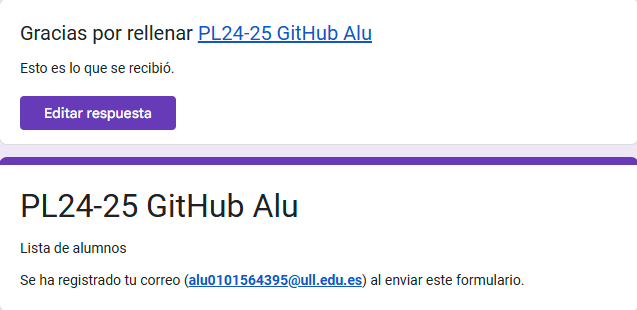
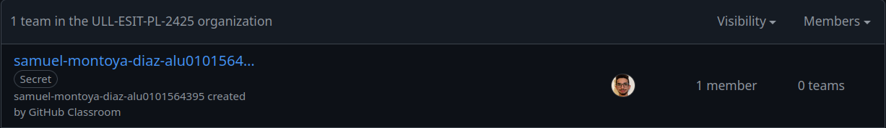
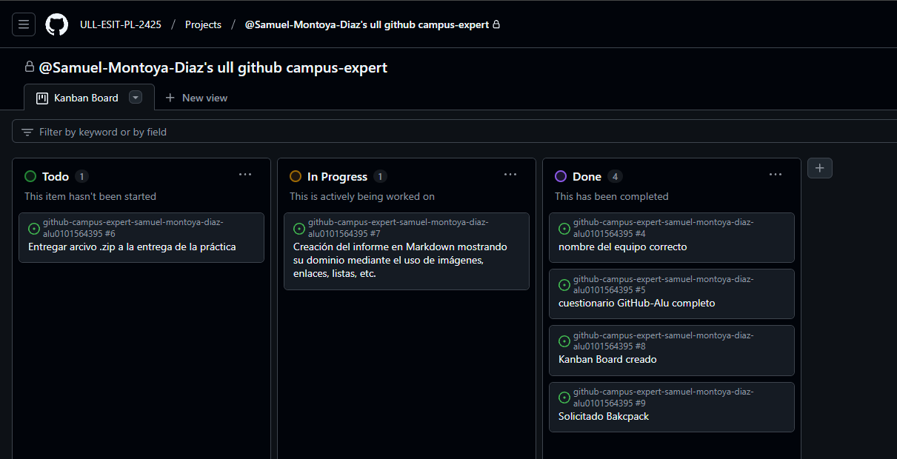

# Github Campus Expert 

# Author:
- Samuel 
- Montoya Díaz 
- alu0101564395

# Index
[Cuestionario](#Rellenar-el-cuestionario-GitHub-Alu-del-campus-virtual-y-recibir-el-correo-confirmándolo)
[Equipo](#Creacion-del-equipo-con-nombre-correcto)
[Kanban](#Creación-del-project-board-kanban-para-este-repositorio)
[Gitub-Backpack](#Solicitud-para-el-GitHub-Backpack)

### Cuestionario

### Creación del equipo con nombre correcto

### Creación del project board kanban para este repositorio

### Solicitud para el GitHub Backpack

